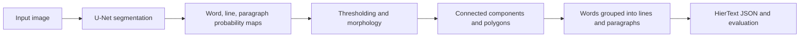

# ICDAR 2023 HierText — Hierarchical Text Detection

Competition research code for detecting **words, lines, and paragraphs in images** and reconstructing their hierarchy. This repository contains my work as part of the **Upstage KR team**, which placed **1st in Task 1 of the ICDAR 2023 HierText competition**, with **76.85% H-PQ**. The result is documented in the [official competition report, Table 1](https://arxiv.org/pdf/2305.09750).

The repository covers data preparation, segmentation-model training, inference, prediction ensembling, geometric post-processing, and evaluation. The reported score belongs to the team's competition submission; this public snapshot does not include the trained checkpoints or a complete reproduction package for that result.

## What was the challenge?

The **ICDAR 2023 Competition on Hierarchical Text Detection and Recognition**, organized by Google Research, brought text detection and layout analysis together. For hierarchical detection, finding individual words is only part of the problem: a system must also identify which words form a line and which lines belong to a paragraph.

The competition had two tracks:

| Track | Expected output |
| --- | --- |
| **Task 1: Hierarchical Text Detection** | Word polygons, with words grouped into lines and lines grouped into paragraphs. Transcriptions are not required. |
| **Task 2: Word-Level End-to-End Text Detection and Recognition** | Word polygons and their text transcriptions. |

**This repository focuses on Task 1.** Its detection output represents the structure `image → paragraphs → lines → words`. That structure supports downstream OCR and document understanding.

Task 1 is ranked by **H-PQ**, the harmonic mean of word-, line-, and paragraph-level Panoptic Quality. PQ accounts for both detection quality and how closely predicted regions match the ground truth, so incorrect grouping can hurt the score even when individual words are detected. See the [competition report](https://arxiv.org/pdf/2305.09750) for the evaluation protocol.

## Dataset

The [HierText dataset](https://github.com/google-research-datasets/hiertext) contains **11,639 images** from Open Images, covering natural scenes and documents with word, line, and paragraph annotations.

| Split | Images |
| --- | ---: |
| Train | 8,281 |
| Validation | 1,724 |
| Test | 1,634 |

Images and annotations must be downloaded separately using the instructions in the official dataset repository. The loader expects this layout under the configured `input_dir`:

```text
HierText/
├── gt/
│   ├── train.jsonl
│   ├── validation.jsonl
│   └── test.jsonl
├── train/
├── validation/
└── test/
```

Despite the `.jsonl` extension, these annotation files are read as a single JSON object containing an `annotations` array.

## What this repository implements

The approach combines learned segmentation with geometric reconstruction:



1. **Training targets and augmentation.** HierText annotations are converted into region masks, instance maps, boundary targets, and illegibility masks. The code includes image augmentation and experiments with mask erosion, polygon shrinking, and CutMix.
2. **Multi-level segmentation.** A U-Net from `segmentation_models_pytorch` uses configurable EfficientNet-B7 or EfficientNetV2-L encoders. The current model has six output channels: three region channels for words, lines, and paragraphs, plus three auxiliary boundary channels.
3. **Training and validation.** PyTorch Lightning orchestrates training, mixed precision, distributed execution, checkpointing, and TensorBoard logging. Loss experiments include symmetric Lovász and a combination of Dice, focal, and binary cross-entropy losses for boundary supervision.
4. **Inference and ensembling.** Prediction scripts save probability maps and image metadata. Optional test-time augmentation combines flips, channel permutation, and multiple scales; the ensemble script averages region maps from four saved prediction sets.
5. **Hierarchy reconstruction.** Post-processing thresholds each region map, extracts components and polygons, and uses overlap to assign words to lines and lines to paragraphs. It also supports promoting confident unmatched detections into new parent groups.
6. **Evaluation and submission generation.** The code exports nested HierText annotations and includes the HierText evaluator for scoring word, line, and paragraph predictions. Threshold-search scripts support post-processing experiments.

## Code map

| File | Role |
| --- | --- |
| [data.py](data.py) | Dataset loading, target generation, augmentation, and data loaders |
| [model.py](model.py) | Six-channel U-Net segmentation model |
| [lightning_module.py](lightning_module.py) | Training steps, losses, optimizer, and validation metrics |
| [losses.py](losses.py), [combo_loss.py](combo_loss.py) | Segmentation loss implementations |
| [train.py](train.py), [config/](config/) | Training entry point and experiment configurations |
| [predict.py](predict.py) | Checkpoint inference, optional augmentation, and saved probability maps |
| [utils.py](utils.py) | Mask and polygon operations, hierarchy reconstruction, and output serialization |
| [ensemble.py](ensemble.py) | Four-way probability-map averaging and submission conversion |
| [make_submission.py](make_submission.py), [run_combined.py](run_combined.py) | Saved-prediction conversion and post-processing experiments |
| [search_th.py](search_th.py), [run.py](run.py) | Threshold sweeps and evaluation orchestration |
| [eval.py](eval.py), [evaluator/](evaluator/) | HierText evaluation implementation |
| [evaluate.py](evaluate.py) | Checkpoint validation using the training module's metrics |

## Using the code

This is a research snapshot from the competition, with multiple experiment variants retained. Before running it:

- Download the dataset and update the paths, GPU devices, batch sizes, and checkpoint settings in the chosen configuration.
- Use [requirements.txt](requirements.txt) as a dependency starting point. Versions are unpinned, and additional imports include `scikit-image`, `timm`, `torchmetrics`, and `tqdm`. The code uses older Lightning APIs such as `validation_epoch_end`, so a current dependency installation may require adaptation.
- Align the configuration and script interfaces. For example, some scripts use `component_min_prob` while later configurations use `component_min_probs`; older callers also pass `vertices_expand_ratio` while the current submission helper accepts `vertices_expand_factor` and `vertices_expand_max_dist`.
- Provide your own trained checkpoint for inference. No model weights are included in this repository.

The main workflow is `train.py → predict.py → post-processing/submission conversion → eval.py`. Once a valid submission file is available, the evaluator can be invoked as follows, replacing the example paths:

```bash
python eval.py \
  --gt=/path/to/HierText/gt/validation.jsonl \
  --result=/path/to/predictions.jsonl \
  --output=/path/to/scores.txt \
  --mask_stride=1 \
  --eval_lines \
  --eval_paragraphs \
  --num_workers=4
```

The detection pipeline leaves transcription fields empty. [e2e_submission.py](e2e_submission.py) preserves an integration experiment with an external `ocr_recognizer` package and checkpoint, neither of which is included; it is not a standalone Task 2 recognition implementation.

## Acknowledgments

This work was part of a team effort at **Upstage**. Thanks to the **Google Research HierText organizers** for the dataset and evaluation tools, and to the maintainers of PyTorch, PyTorch Lightning, and Segmentation Models PyTorch.

- [Official competition report](https://arxiv.org/abs/2305.09750)
- [HierText dataset and evaluation tools](https://github.com/google-research-datasets/hiertext)
- [Competition website](https://rrc.cvc.uab.es/?ch=18)
